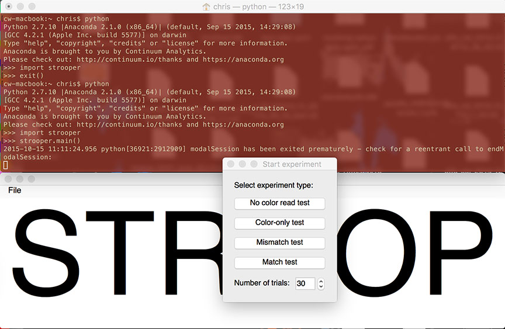
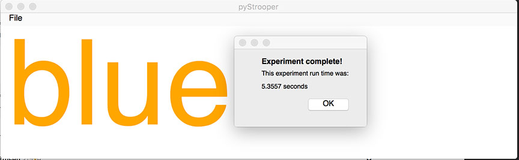

# PyStrooper
This is a Python package for demonstrating the Stroop effect. 

This effect is that it is much slower to name the color of text when that text spells a different color.

For example, you are much quicker at naming the color of this text:

<span style="color:red">red</span>

than you are at reading 

<span style="color:orange">blue</span>

## Installation:
If you don't yet have Python, I recommend the Anaconda Python. This software is written to be compatible with python 2
and 3, so please use the appropriate Anaconda installation.

If you don't use Anaconda, the good news is that the only requirement for this package is PyQt4!

With Python and PyQt4 installed, clone or download the Zip file for this repository and run:

```
> python setup.py install
```

## Use:

Fire up Python to run the program:

```
>>> import strooper
>>> strooper.main()
```



From here, select the experiment that you want to run. Each experiment tests a different condition:

* Color-only (name the color of the text)
* Match test: name the color of the text (the text will be the name of the color displayed)
* Mismatch test: name the color (the text will be a *different* color name than the actual color of the text)
* Reading only: just read the text, which will be colored black ( this should be very fast )

After you say aloud the color of the text, press spacebar. When you complete the set number of trials, a total time
will be calculated and displayed.


